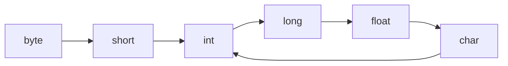

### 프로그래밍기초

# 1. #include

### 헤더파일
- 확장자 : .h
- 시스템 헤더파일 : 개발 도구에서 제공
  ex) #include <stdio.h>
- 사용자 헤더파일: 프로그래머가 만든 헤더파일
  ex) #include "userheader.h"

### 주요 시스템 헤더파일
- stdio.h
- stdlib.h
- math.h -> squr()
- string.h
- time.h
- ctype.h
- limits.h
- float.h

 ### 사용자 헤더파일 (user defined header file)
 - 소스 파일을 만들듯 사용자가 직접 만들어 저장한 후 전처리기 #include를 사용하여 내 소스파일에 포함시키면 된다.
 
##### 예제
```
typedef unsigned char BYTE; // <헤더.h>의 코드
#include <stdio.h> // #include "stdio.h" 가능
#include "헤더.h" // #include <헤더.h> 불가능

int main(void)
{
	BYTE a, b;
	a = 'A';
	b = 'B';
	printf("ASCII code of %c is %d\n", a, a);
	printf("ASCII code of %c is %d\n", b, b);
}
```
```
- 출력 결과
ASCII code of A is 65
ASCII code of B is 66
```

# 2. #define
### 기호상수(symbolic constant) by #define
#define name replacement text
- define : 선행처리기 지시자
- name은 식별자 규칙을 따라야함 (대개 대문자 사용)
- replacement text에는 어떤 자료형도 다 올 수 있다. 식별자도 올 수 있다.

### 지시자는 한 줄에 처리
- 만약 치환문자열이 길어서 한 줄에 코딩을 다 할 수 없는 경우는 계속되는 줄 끝에 역 슬래쉬 \를 넣어 줄이 계속되고 있음을 표시해야한다.

```
#define MESSAGE "프로그램 언어의 학습은 일반 언어의 학습\
과 같이 반복 학습이 중요하다."
```

##### 예
```
typedef unsigned char BYTE;
#include <stdio.h>

#include "헤더.h"
#define STR "즐거운 프로그래밍기초 수업입니다."
#define STR1 "즐거운 프로그래밍기초\
수업입니다."

void main()
{
	BYTE i, ch; // 0~255
	char c; //-128~127
	c = ch = 255;
	printf("%d %d %d\n", ch, ch + 1, ch + 2);
	printf("%#x %#X %#X %#o %#o\n", ch, ch, ch + 1, ch + 2, ch + 2);
	printf("%d %d %d\n", c, c + 1, c + 2);
	i = 48; //ASCII code for '0'
	printf("%c %c %c\n", i, i + 1, i + 2);
	printf("%d %d %d\n", i, i + 1, i + 2);
	printf("%s\n", STR);
	printf("%s\n", STR1);
	ch = ch + 1; //Maximum value that can be stored in ch : 255
	printf("%d %d %d\n", ch, ch + 1, ch + 2);
}
```

- 출력 결과
```
255 256 257
0xff 0XFF 0X100 0401 0401
-1 0 1
0 1 2
48 49 50
즐거운 프로그래밍기초 수업입니다.
즐거운 프로그래밍기초수업입니다.
0 1 2
```

### 인자가 있는 매크로(macro)
- #define의 기호상수 뒤에 오는 치환문자열에는 일반상수, 상수의 연산, 이미 정의된 기호상수 등이 올 수 있다
- #define의 활용도를 높이기 위한 방안으로 인자(parameter)를 이용하여 매크로 함수를 만드는 방법이 있다.
- 기호상수 이름 뒤에 ()를 넣고 그 안에 인자를 넣는다. 이때 기호상수 이름과 () 사이에 공백이 있어서는 안된다.
  
  ex) 어떤 수의 제곱승을 구할 수 있는 매크로
  
  #define SQUARE(x) ((x)*(x))
  
  printf("%d %d", SQUARE(2), SQUARE(3));
  
  printf("%d %d", ((2)*(2)), ((3)*(3)));
- 매크로 함수도 기호인데 일반 함수처럼 인자를 갖는다는 점이 특징이다. 그러나 일반 함수와 동일하지 않다. 

# 궁금한 점


**첫 번째 코드**
```
#include <stdio.h>
int main(void)
{
	unsigned char ch = 256;
	printf("%d %d %d\n", ch, ch + 1, ch + 2);

	unsigned char ch2 = 255;
	printf("%d %d %d\n", ch2, ch2 + 1, ch2 + 2);
}
```
- 출력 결과
```
0 1 2
255 256 257
```

Q. 왜 ch2의 출력 결과가 256 0 1이 아닌 255 256 257일까? unsigned char의 range는 0~255이기 때문에 오버플로우가 ch2 + 1, ch2 + 2에서 오버플로우가 일어나 출력 결과가 255 0 1라고 예상했다.

=> unsigned char을 출력하는 format specifier가 %d가 아닌 %u이기에 format specifier가 잘못되었다고 생각해 다음과 같이 코드를 추가해보았다.

**두 번째 코드**
```
#include <stdio.h>
int main(void)
{
	unsigned char ch = 256;
	printf("%d %d %d\n", ch, ch + 1, ch + 2);

	unsigned char ch2 = 255;
	printf("%d %d %d\n", ch2, ch2 + 1, ch2 + 2);

	unsigned char ch3 = 256;
	printf("%u %u %u\n", ch3, ch3 + 1, ch3 + 2);

	unsigned char ch4 = 255;
	printf("%u %u %u\n", ch4, ch4 + 1, ch4 + 2);
}
```

- 출력 결과

```
0 1 2
255 256 257
0 1 2
255 256 257
```

출력 결과는 %d와 %u가 동일했다. format specifier의 문제가 아니었다. 

ch를 출력한 결과와 ch2를 출력한 결과가 다른 이유는 **ch2의 자료 유형과 ch2에 더해지는 피연산자 1의 자료유형이 다르기 뗴문**에 출력 결과가 다르게 나타났다. ch2에 1이 더해질 때 형변환이 일어났기 때문이다. 

### 형변환(Type Conversion)

- 형변환이란 데이터의 타입을 변경하는 것이다.

  다음 코드를 살펴보자.
```
int a = 10;
float b = 1.2;
printf("%d", a+b);
```

- 출력 결과
```
1610612736
```

예상한 출력 결과와 다를 것이다. 10과 1.2를 더하면 11.2 또는 11이 출력될 거라고 예상하지만 결과가 다르다. 왜냐하면 변수 a와 변수 b가 더해질 때 변수 a는 변수 b에 의해 **묵시적 형변환(Implicit Type Conversion)**이 일어났기 때문이다. 

### 묵시적 형변환(Implicit Type Conversion)이란?

묵시적 형변환이란 컴파일러에 의해 자동으로 형변환이 이루어지는 것이다. 보통 컴퓨터는 서로 다른 자료형끼리 계산을 못하기 때문에 컴파일러가 티내지 않고 자료형을 변환시킨다. 





```
#include <stdio.h>
int main(void)
{
	unsigned char ch = 256;
	printf("%d %d %d\n", ch, ch + 1, ch + 2);

	printf("%d %d\n", sizeof(ch), sizeof(ch + 1));

	unsigned char ch2 = 255;
	printf("%d %d %d\n", ch2, ch2 + 1, ch2 + 2);

	unsigned char ch3 = 256;
	printf("%u %u %u\n", ch3, ch3 + 1, ch3 + 2);

	printf("%d %d\n", sizeof(ch3), sizeof(ch3 + 1));

	unsigned char ch4 = 255;
	printf("%u %u %u\n", ch4, ch4 + 1, ch4 + 2);
}
```
